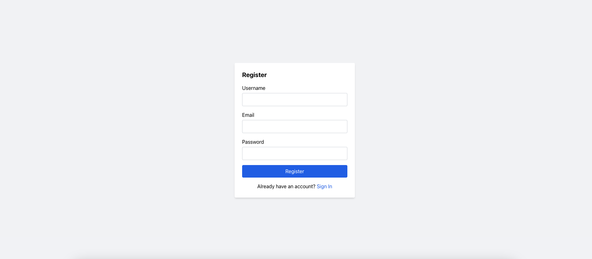
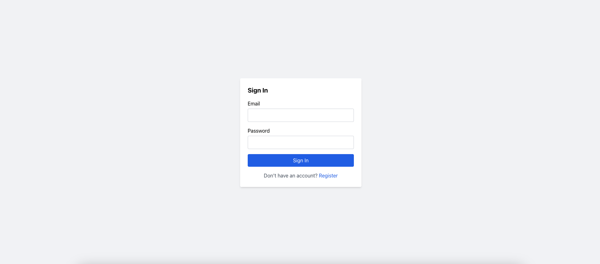
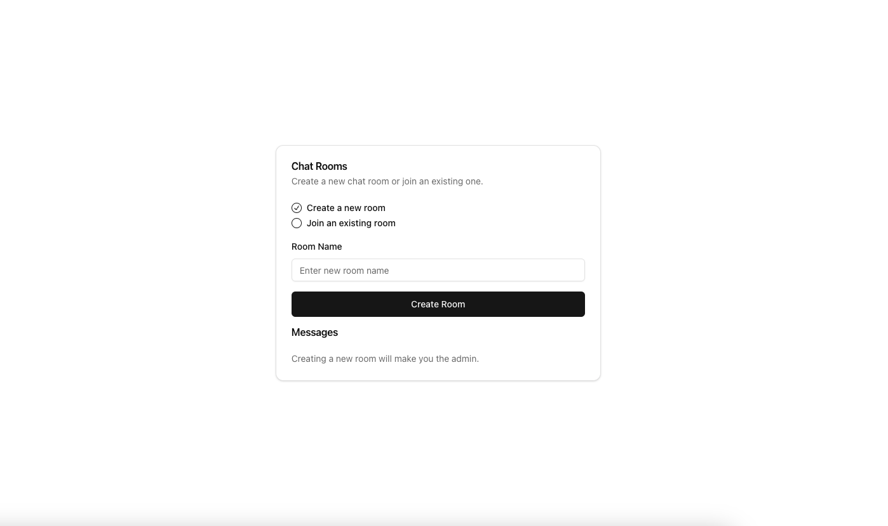
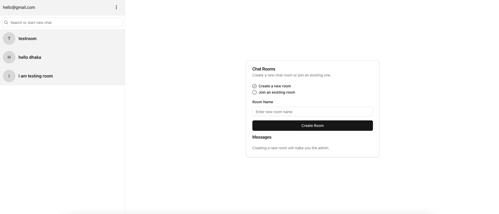
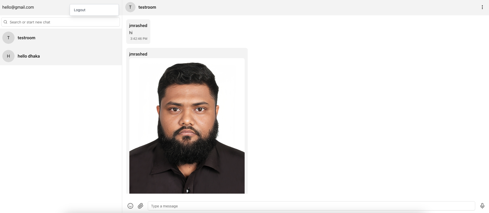

# Real-Time Chat Application (Client)

[](https://github.com/jmrashed/chat-frontend/actions/workflows/ci.yml)
[](https://opensource.org/licenses/MIT)
[](https://nodejs.org/)
[](https://nextjs.org/)
[](https://reactjs.org/)
[](https://www.typescriptlang.org/)
[](https://socket.io/)
[](https://tailwindcss.com/)
[](https://eslint.org/)
[](https://prettier.io/)
[](https://vercel.com/)
[](http://makeapullrequest.com)
[](https://github.com/jmrashed/chat-frontend/stargazers)
[](https://github.com/jmrashed/chat-frontend/network/members)

This is the client-side of a real-time chat application built using [Next.js](https://nextjs.org), bootstrapped with [`create-next-app`](https://nextjs.org/docs/app/api-reference/cli/create-next-app). The project is designed to enable seamless and efficient communication with real-time updates.

## Related Repositories

**Backend Server**: For the complete chat application experience, you'll also need the backend server. Check out the [Chat Backend Repository](https://github.com/jmrashed/chat-backend) which provides:
- Real-time Socket.IO communication
- User authentication with JWT
- File sharing capabilities
- MongoDB integration
- RESTful API endpoints

## Getting Started

To run the client-side of this project, follow these steps:

1. Clone the repository:

```bash
git clone https://github.com/jmrashed/chat-frontend.git
cd chat-frontend
```

2. Install dependencies:

```bash
npm install
# or
yarn install
# or
pnpm install
```

3. Run the development server:

```bash
npm run dev
# or
yarn dev
# or
npm dev
# or
bun dev
```

4. Open [http://localhost:3000](http://localhost:3000) in your browser to view the application.

You can start editing the UI by modifying `app/page.tsx`. The page will automatically update as you make changes.

## Features

- **Real-Time Communication**: The chat application allows users to communicate in real time.
- **Optimized Performance**: Leveraging Next.js features, the application is optimized for performance and responsiveness.
- **Custom Fonts**: The application uses the [`next/font`](https://nextjs.org/docs/app/building-your-application/optimizing/fonts) utility to optimize and load the [Geist](https://vercel.com/font) font family for a modern and clean UI.

## Learn More

To get more details on the tools and technologies used in this project, take a look at these resources:

- [Next.js Documentation](https://nextjs.org/docs) - Learn about Next.js features and API.
- [Learn Next.js](https://nextjs.org/learn) - An interactive tutorial for learning Next.js.

You can also check out the [Next.js GitHub repository](https://github.com/vercel/next.js) to contribute or provide feedback.

## Deploy on Vercel

To deploy the client-side of this chat application, you can use the [Vercel Platform](https://vercel.com/new?utm_medium=default-template&filter=next.js&utm_source=create-next-app&utm_campaign=create-next-app-readme), which is optimized for Next.js applications.

For detailed instructions, refer to the [Next.js deployment documentation](https://nextjs.org/docs/app/building-your-application/deploying).

## Testing

Run the test suite:

```bash
npm test
# or
npm run test:watch  # Watch mode
npm run test:coverage  # With coverage
```

## Contributing

We welcome contributions! Please see our [Contributing Guide](CONTRIBUTING.md) for details.

1. Fork the repository
2. Create your feature branch (`git checkout -b feature/amazing-feature`)
3. Commit your changes (`git commit -m 'Add some amazing feature'`)
4. Push to the branch (`git push origin feature/amazing-feature`)
5. Open a Pull Request

## Code of Conduct

This project adheres to our [Code of Conduct](CODE_OF_CONDUCT.md). By participating, you are expected to uphold this code.

## Security

For security concerns, please review our [Security Policy](SECURITY.md).

## License

This project is licensed under the MIT License - see the [LICENSE](LICENSE) file for details.

## Support

If you have any questions or need help, please:
- Check the [documentation](docs/)
- Open an [issue](https://github.com/jmrashed/chat-frontend/issues)
- Join our discussions
 


 ## Screenshots

Here are some screenshots of the project:

### Screenshot 1


### Screenshot 2


### Screenshot 3


### Screenshot 4


### Screenshot 5



## 👨‍💻 Author

**Md Rasheduzzaman**  
Full-Stack Software Engineer & Technical Project Manager  

Building scalable, secure & AI-powered SaaS platforms across ERP, HRMS, CRM, LMS, and E-commerce domains.  
Over 10 years of experience leading full-stack teams, cloud infrastructure, and enterprise-grade software delivery.

**🌐 Portfolio:** [jmrashed.github.io](https://jmrashed.github.io/)  
**✉️ Email:** [jmrashed@gmail.com](mailto:jmrashed@gmail.com)  
**💼 LinkedIn:** [linkedin.com/in/jmrashed](https://www.linkedin.com/in/jmrashed/)  
**📝 Blog:** [medium.com/@jmrashed](https://medium.com/@jmrashed)  
**💻 GitHub:** [github.com/jmrashed](https://github.com/jmrashed)

---

> *“Need a Reliable Software Partner? I build scalable, secure & modern solutions for startups and enterprises.”*